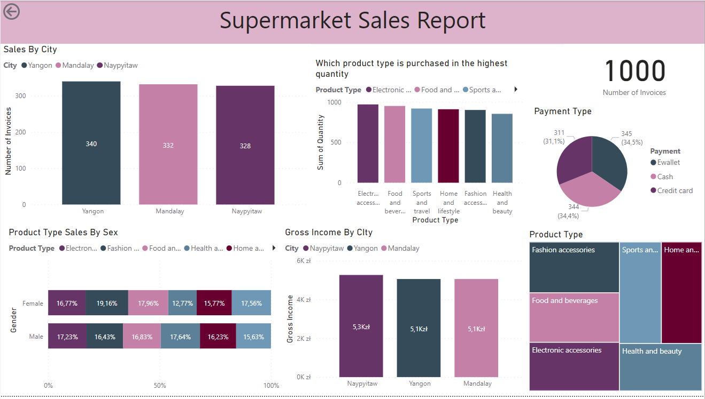
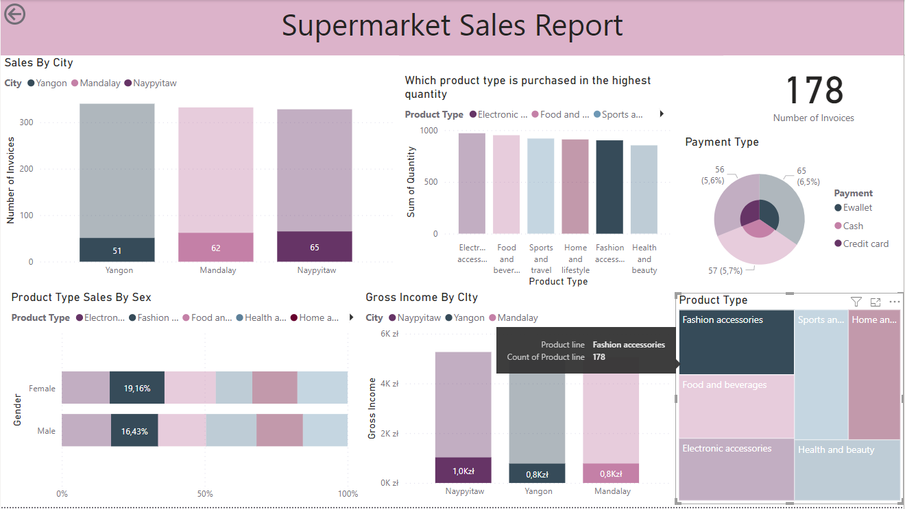

# Supermarket Sales Report

Welcome to the "Supermarket Sales Report" Power BI project. This report provides a comprehensive analysis of supermarket sales data, offering insights into sales trends, product performance, and customer demographics in 3 cities.

## Screenshots

### Overall Dashboard

### Product Type: Fashion Accessories

## Elements

The "Supermarket Sales Report" project includes the following elements:

1. **Sales by City:** Visualizes sales data by different cities, allowing you to explore regional sales patterns.

2. **Which Product Type is Purchased in the Highest Quantity:** Identifies the product category that customers purchase in the highest quantity.

3. **Product Type Sales by Sex:** Breaks down product sales by gender, providing insights into customer preferences.

4. **Gross Income by City:** Analyzes the gross income generated by each city.

5. **Payment Type:** Examines the distribution of payment methods used by customers.

6. **Product Type:** Provides an overview of product categories and their respective sales.

7. **Number of Invoices:** Displays the number of invoices generated over time.

## Usage

To explore the "Supermarket Sales Report" project, follow these steps:

1. Download the project files from this repository.

2. Open the Power BI file named "Supermarket Sales Report.pbix" using Power BI Desktop.

3. Navigate through the different parts of the report to explore the various insights and visualizations.

4. Interact with the report by using filters and slicers to customize your analysis.

## Data Source

The data for this project comes from the "supermarket_sales - Sheet1.csv" file located in the project folder.
